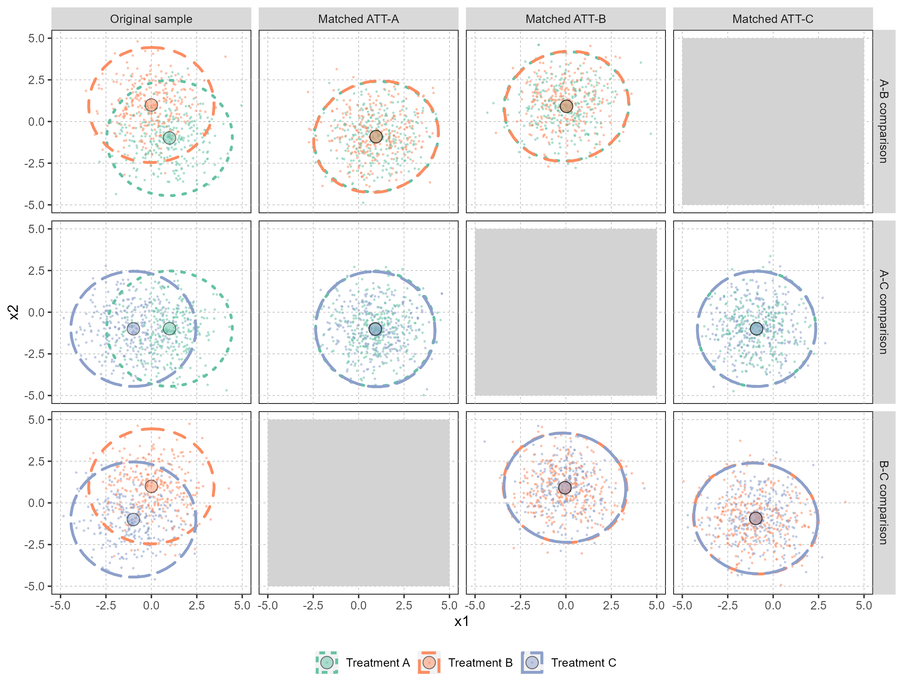

```{r setup, include=FALSE}

# Set document properties
knitr::opts_chunk$set(echo = FALSE)
knitr::opts_chunk$set(message = FALSE)
knitr::opts_chunk$set(warning = FALSE)

# Load R packages
library(rmarkdown)
library(tibble)
library(knitr)
library(dagitty)
library(ggdag)
library(naniar) # Visualization of missing data
library(reshape2)
library(tableone)
library(ggmice) # visualize predictor matrix
library(cobalt) # love plots (covariate balance pre- and post-matching)

# Load R functions
source("R/ps.r")
source("R/visualisation.r")
source("R/sim.r")

# Load most recent simulation results 
load("Datasets/Scenario 2/simdat.rda") # Simulated data
sim2 <- sim
load("Datasets/Scenario 1/simdat.rda") # Simulated data

```

# Build Info 
This report was generated using `r R.version.string`. The following key packages were used:

* *pandoc* (version `r as.character(pandoc_version())`): Report output
* *MatchIt* (version `r packageVersion("MatchIt")`): Nearest-neighbour matching
* *sandwich* (version `r packageVersion("sandwich")`): Estimation of (cluster-)robust standard errors
* *dplyr* (version `r packageVersion("dplyr")`): Facilitate data manipulation
* *tibble* (version `r packageVersion("tibble")`): Facilitate data manipulation
* *ggplot2* (version `r packageVersion("ggplot2")`): Visualization of results
* *mice* (version `r packageVersion("mice")`): Multivariate Imputation by Chained Equations
* *mvtnorm* (version `r packageVersion("mvtnorm")`): Draw x1 and 1x from bivaraite normal distribution
* *ggmice* (version `r packageVersion("ggmice")`): Visualize predictor matrix of imputations

# Methods 

## Data-generating mechanism 

We generated data for a super-population of $N=100,000$ individuals treated with treatment A, B, or C. We generated two continuous variables $x_1$ and $x_2$ for each patient as baseline covariates, labeled as age (standardized) and disease severity (z-score). We generated a potential outcome, labeled as a test score for which higher values are better, under each of the three treatments. The test scores were generated from a linear model with age, disease severity, and the treatment indicators as main effects and an interaction term between the treatment indicators and age to introduce treatment effect heterogeneity. The outcome $y$ is continuous, and generated as follows:

$y_i \sim N(\mu_i, \sigma^2)$

with

$\mu_i = \beta_0 + \beta_1  x_{1i} + \beta_2 x_{2i} + \beta_3 I_{Bi} + \beta_4 I_{Ci} + (\beta_5 I_{Bi} + \beta_6 I_{Ci}) x_{1i}$


Using the following regression coefficients:

* Baseline outcome risk ($\beta_0$): **`r sum(sim$pars$beta0)`**
* Confounder effect of $x_1$ ($\beta_1$): **`r sum(sim$pars$beta1)`**
* Confounder effect of $x_2$ ($\beta_2$): **`r sum(sim$pars$beta2)`**
* Treatment effect of B versus A ($\beta_3$): **`r sum(sim$pars$beta3)`**
* Treatment effect of C versus A ($\beta_4$): **`r sum(sim$pars$beta4)`**
* Standard deviation of the residual error ($\sigma$): **`r sum(sim$pars$sigma)`**


Depending on the selected scenario, the values for $\beta_5$ and $\beta_6$ were modified.

**Scenario 1**: Absence of treatment effect heterogeneity (HTE)

* Effect modification between B and x1 ($\beta_5$): **`r sum(sim$pars$beta5)`**
* Effect modification between C and x1 ($\beta_6$): **`r sum(sim$pars$beta6)`**

We assigned the treatment received as a function of the two baseline covariates $x_1$ and $x_2$. Thus, the observable dataset consisted of the two baseline covariates, the treatment received and one outcome – the one generated under the treatment that the patient received.  

## Sampling distributions and parameter information

The treatment groups were sampled in equal sizes. The two continuous variables $x_1$ and $x_2$ were drawn from a bivariate normal distribution using the *mvtnorm* package, using the following mean values:

```{r, include = T}
t.simpar <- data.frame(
  treatment = c("A", "B", "C"), 
  x1_mean = c(1, 0, -1),
  x2_mean = c(-1, 1, -1)
  )

colnames(t.simpar) <- c("Treatment", "Mean age", "Mean disease severity")
kable(t.simpar, caption = "Sampling means")

```

And the following covariance matrix:
```{r}
t.simsigma <- matrix(c(2, 0, 0, 2), ncol = 2)
colnames(t.simsigma) <- rownames(t.simsigma) <- c("x1", "x2")

kable(t.simsigma, caption = "Variance-covariance matrix of the baseline covariates")

```


## Directed acyclic graph

To illustrate the relation between the treatment, the outcome and the treatment covariate interactions, a Directed acyclic graph is used. A, B, and C indicate the three treatment groups, Y is the outcome and x1 and x2 depict the covariates (age and disease severity). Both covariates influence the outcome  $y_i$, but only in the presence of HTE do they also influence treatment B and C. 
 
<br />  
DAG in the absence of HTE  

```{r dag-scenario1}
dag <- dagitty('dag {
bb="-2.65,-2.559,2.611,2.61"
Y [outcome,pos="1.979,0.586"]
A [exposure,pos="-1.780,-0.206"]
B [exposure,pos="-1.780,0.486"]
C [exposure,pos="-1.820,1.196"]
x1 [adjusted,pos="-0.060,1.940"]
x2 [adjusted,pos="0.959,1.940"]
A -> Y
B -> Y
C -> Y
x1 -> Y
x2 -> Y
}
')

ggdag(dag) + theme_dag() + geom_dag_text(col = "white")

```

## Implementation of pairwise matching 

We applied 1:1 PS nearest-neighbor matching with a caliper and with replacement for each pairwise treatment comparison. We estimated the propensity score with a logistic regression model as a function of the two baseline covariates separately for each treatment comparison to mimic how pairwise matching would be repetitively applied in the context of three treatments being compared. We used a caliper of 0.05 standard deviation of the logit of the estimated PS. We assessed covariates balance pre- and post-matching with absolute standardized mean differences.  

For each treatment comparison, we generated created two matched samples, separately targeting eachither of the ATTs. For example, for the comparison of treatment A vs B, we first match individuals treated with B to individuals treated with A, thus targeting the ATT-A. A first matched sample results from this matching. Second, starting from the original sample again, we now match individuals treated with A to individuals treated with B, targeting the ATT-B, which results in a second matched sample. For each treatment comparison and in each matched sample, we estimate the treatment effect (e.g., difference in means at a certain timepoint) using a linear regression model. We note that, in an application of pairwise matching to real data, researchers would typically generate only one matched sample, targeting one estimand or the other.  

## Evaluation and visualization 

For the evaluation and visualization of covariate overlap, we compared the target populations before and after matching for all pairwise treatment comparisons with the bivariate ellipses. We also compared the estimated treatment effects in the matched sample.


# Results

## Scenario 1: Absence of HTE

```{r}
# Load most recent simulation results 
load("Datasets/Scenario 1/simdat.rda") # Simulated data
load("Datasets/Scenario 1/results.rda") # ATT estimates
```

We generate a superpopulation of `r formatC(sim$pars$n, format = "fg")` patients, in which there are **`r sum(sim$data$treatment == "A")`** observations with drug A, **`r sum(sim$data$treatment == "B")`** observations with drug B and **`r sum(sim$data$treatment == "C")`** observations with drug C. Due to the presence of confounding, population characteristics differ across the three treatment groups.

```{r densplot1, message = FALSE}
densplot_X(sim, ggtype = "point", palette = "Set2")
```

The continuous outcome $y$ is generated from the linear predictor:

$\mu_i$ = `r sim$pars$beta0` + `r sim$pars$beta1` $x_{1i}$ + `r sim$pars$beta2` $x_{2i}$ + `r sim$pars$beta3` $I_{Bi}$ + `r sim$pars$beta4` $I_{Ci}$

For all analyses, we apply nearest neighbor matching with a caliper width of `r sim$pars$caliper` SD of the logit of the estimated PS. This results in a caliper of `r round(sim$caliper_AB,3)` for AB comparisons, a caliper of `r round(sim$caliper_AC,3)` for AC comparisons, and a caliper of `r round(sim$caliper_BC,3)` for BC comparisons. Afterwards, treatment effect estimates are derived using linear regression in the matched sample. A sandwich estimator is used to calculate cluster-robust standard errors.


```{r}
treatment <- c("A", "B", "C")
colors <- brewer.pal(3, "Set2")
```

\newpage 
## Love plots
\

```{r, fig.dim = c(9, 9)}
save_all_loveplots(scenario = "Scenario 1", saveimg = F)
```

\newpage 
## Balance plots
\

```{r, fig.dim = c(12, 12)}
save_all_balanceplots(scenario = "Scenario 1", saveimg = F)
```

\newpage 
## Difference between ATTA and ATTB
\
Joy plot displaying the differences between ATTA and ATTB \
```{r dif-ATTA-ATTB1v2}
plot_joy_x(sim, population = "AB", replace = TRUE)

```


\newpage 
## Difference between ATTA and ATTC
\
Joy plot displaying the differences between ATTA and ATTC \

```{r dif-ATTA-ATTC1v2}
plot_joy_x(sim, population = "AC", replace = TRUE)

```


\newpage 
## Difference between ATTB and ATTC
\
Joy plot displaying the differences between ATTB and ATTC \
```{r dif-ATTB-ATTC1v2}
plot_joy_x(sim, population = "BC", replace = TRUE)

```


\newpage 
## Overall distribution of covariates

Distribution of the matched samples (matching with replacement)
<p>
   
</p>   


## Treatment effect estimates

```{r}
knitr::kable(subset(results, Replace == TRUE), caption = "Treatment effect estimates for Scenario 1 when adopting matching with replacement")
``` 

***
